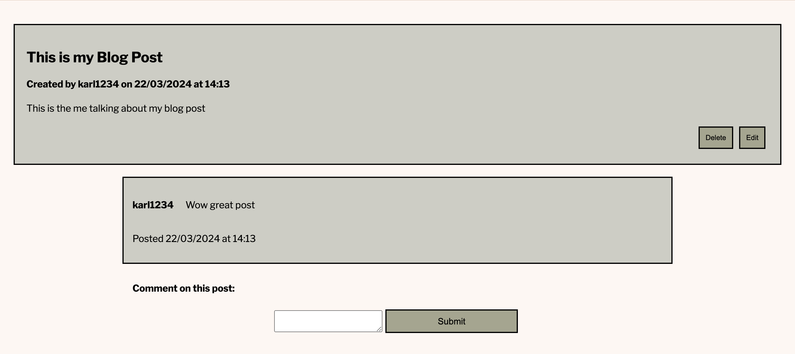

# Technology-Blog

## Description
The following project was completed as a part of the Adelaide University Web Development Bootcamp. The aim was to create a content management system for blog posts regarding technology which would allow anybody to sign up and make their own posts to be seenb by other users. By doing so I was able to consolidate my understanding of the MVC paradigm and implemement it for this assignment. This challenge also acted as a great review for Object Relation Models, Route handling and as an introduction to templating engines such as handlebars.js. This has therefore been my first complete fullstack application that also utilises session storage and cookies to log in, log out and create users.

Overall, this has been a great exercise in understanding how to maintain a separation of concerns and how to structure a Fullstack Application.

Access a deployed version of thi application here: https://whispering-coast-99073-14fb6aebab6e.herokuapp.com/ 

## Installation
If you would like to run this project in your local environment follow these instructions.
1. Clone the repository to your local computer using 'git clone'

2. Navigate to the directory and download all necessary packages with 'npm install'

3. Open mysql in the terminal and run 'SOURCE db/schema.sql;' to initiate the database

4. Use 'npm run seed' in the terminal again to seed the database with some example data. 

5. Update the .env file to include your username and password 

6. Run 'node server.js' to execute the server and use the link in the terminal to access the web page.

 
## Usage
Access a deployed version here: https://whispering-coast-99073-14fb6aebab6e.herokuapp.com/

Or use the above instructions to install this project on your local environment. 

If you are not logged in you can browse posted blogs on the homepage, clicking any blog to see if there are any comments associated with them. 

If you click either 'Dashboard' or 'Log in' you will be presented with a Log In page that will allow you to log in if you have an existing account.

If you do not have an existing account, select the 'Create Account' link below the login to navigate to the Sign up page. 

Once logged in or signed up, you can navigate to the dashboard to either create a blog post or view your existing blog posts. 

By Selecting a blog post you will be given the options to either edit or delete the blog if it belongs to you. Otherwise you will have the ability to comment on the blog. 

